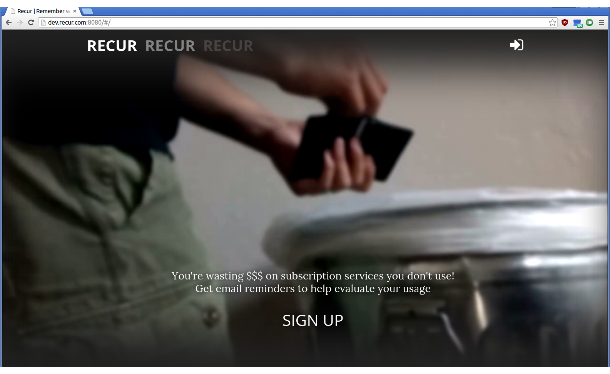
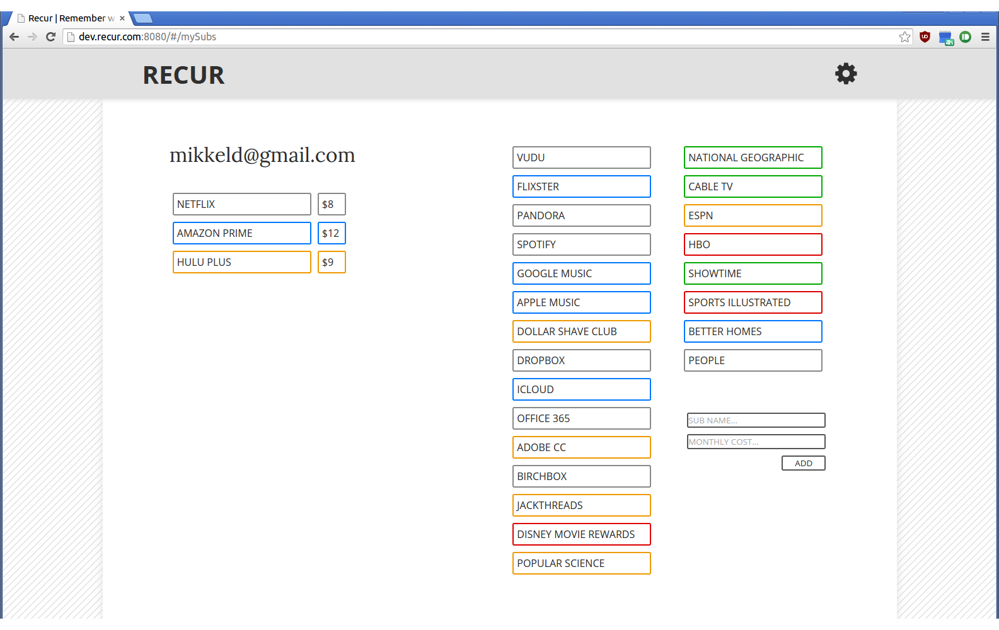
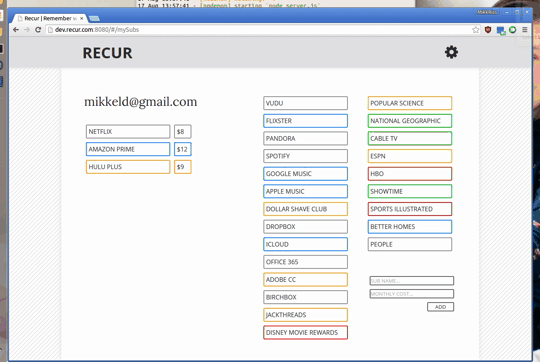
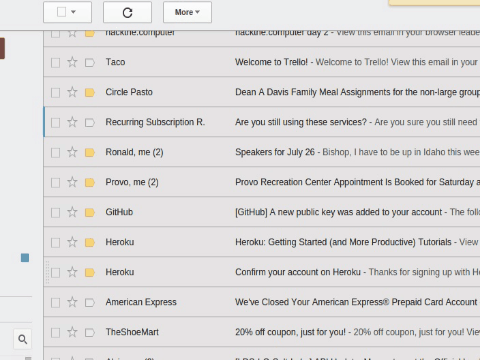

#RECUR

We're all wasting money right now on recurring monthly subscription services we've forgotten about; Recur is intended to help you manage your subscriptions.

###Login using Google+ or Facebook

###Add services to user account from suggested list, and personalize monthly charge, or remove from account.

###Receive a monthly email reminding you how much money you're subconsciously spending in all these places.

####Upcoming features
- [ ] customize reminder emails for charge date of each service

